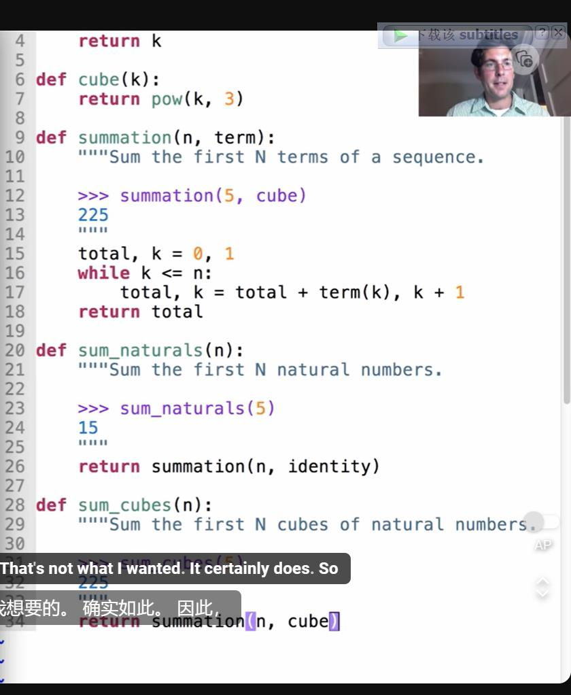
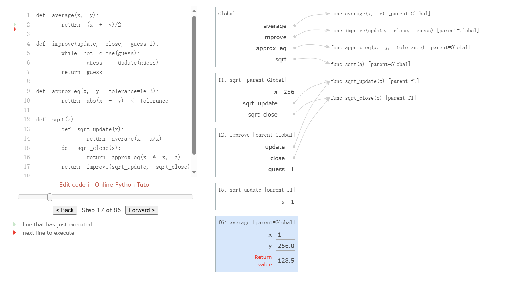

**cd D:\hj\python\CS61A_fall_23\lab\lab02**
# Control Expressions
## if缩进语句和if调用语句的区别
- if缩进语句可以跳过不需要的语句部分
- 而if调用语句需要先运行导入的参数后进行调用，若参数错误则语句错误;如-100，sqrt(-100)
    
## 短路系统
- a and b:
    到达第一个假值后短路，并返回。若均真，返回b
- a or b:
    在第一真处短路，若均假，返回b

|运算符|检查是否：|从左到右运算直到|例子|
|---|--- |------------|---|
| and|所有值都是True|第一个错误值|False and 1/0 evaluates to False|
| or|至少有一个是True|第一个正确值|True or 1/0 evaluates to True|

## assert 语句
- assert <bloolean语句> ,'error statement'

## 封装思想，高阶函数

- 找到算法间的相同思路，用函数进行梗概，导入算法相关形参。减少代码重复次数。
- 接受一个函数作为参数的函数

# Environments for nested def
- 嵌套函数的父框架为定义或创造该函数的框架

# 匿名函数

    '''

    square = lambda x :x*x <arg : exper>
    >>>square(4)
    16
    >>>(lambad x : x*x)(3)
    9

    '''

# 高阶函数

## 基本高阶函数
### 函数作为参数导入
**一般用来寻找通法**
    '''
    def cal(n,item):
        total,num = 0,1
        while num <= n:
            total,num = total + item(n),num+1
        return total
    '''
### 函数作为返回值
**一般为嵌套函数**
    '''
    def one(x):
        def two(y):
            return x*y
        return two
    '''

## 一般迭代函数
    '''
    def improve(update, close, guess=1):
        while not close(guess):
        guess = update(guess)
        return guess
    
    def golden_update(guess):
        return 1/guess + 1

    def square_close_to_successor(guess):
        return approx_eq(guess * guess,guess + 1)

    def approx_eq(x, y, tolerance=1e-3):
        return abs(x - y) < tolerance

    phi = improve(golden_update,square_close_to_successor)
    '''

    检验
    '''
    from math import sqrt
    phi = 1/2 + sqrt(5)/2
    def improve_test():
        approx_phi = improve(golden_update, square_close_to_successor)
        assert approx_eq(phi, approx_phi), 'phi differs from its approximation'
    improve_test()
    '''
## 嵌套函数

### 词汇范围

    '''
    def sqrt(a):
        def sqrt_update(x):
            return average(x, a/x)
        def sqrt_close(x):
            return approx_eq(x * x, a)
        return improve(sqrt_update, sqrt_close)
    '''
本地定义的函数还可以访问在其中定义的作用域中的名称绑定。在本例中，sqrt _ update 引用名称 a，这是其封闭函数 sqrt 的形式参数。这种在嵌套定义之间共享名称的规程称为词法范围。重要的是，内部函数可以访问定义它们的环境(而不是调用它们的环境)中的名称。

### 扩展环境
一个环境可以由任意长的框架链组成，框架链总是以全局框架结束。在这个 sqrt 示例之前，环境最多只有两个帧: 局部帧和全局帧。通过调用在其他函数中定义的函数，通过嵌套的 def 语句，我们可以创建更长的链。调用 sqrt _ update 的环境由三个框架组成: 本地 sqrt _ update 框架、定义 sqrt _ update 的 sqrt 框架(标记为 f1)和全局框架。

- 局部函数的名称不会干扰定义它的函数的外部名称，因为局部函数名称将绑定在定义它的当前局部环境中，而不是全局环境中。
- 局部函数可以访问封闭函数的环境，因为局部函数体是在扩展了其定义的评估环境的环境中进行评估的。

### 函数的作用域
    '''
    def pirate(arggg):
        print('matey')
            def plunder(arggg):
                return arggg
        return plunder
    add(pirate(3)(square)(4),1)
    '''
 **我们需要注意的是pirate(3)的返回值是plunder()函数，这是因为plunder函数和pirate函数的形参arggg只是名称相同，但是是两个不同的变量，无法等同**
 ！[马函数](png/house.png)
 **用def语句时，是先操作一个func()函数再绑定给名字func**

    

## 函数修饰器
    '''
    >>> def trace(fn):
            def wrapped(x):
                print('-> ', fn, '(', x, ')')
                return fn(x)
            return wrapped
    >>> @trace
    def triple(x):
        return 3 * x
    >>> triple(12)
    ->  <function triple at 0x102a39848> ( 12 )
    36
    '''
    等效于

    """    
    >>> def triple(x):
        return 3 * x
    >>> triple = trace(triple)
    """
**注意：被修饰的函数会返回修饰函数的return值（函数或数字）**·

## 函数的迭代应用
！[迭代](png/%E8%BF%AD%E4%BB%A3.png)